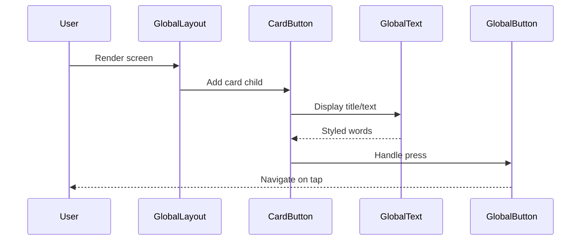

# Chapter 2: UI Component Library

The component library keeps Salmon’s surfaces consistent across web, extension, and mobile while enforcing accessibility and hierarchy.

## Goals
- One source of truth for buttons, inputs, alerts, cards, and typography.
- Opinionated spacing and color tokens that match the Salmon brand.
- Built-in states: hover, focus, error, loading.
- Easy theming for light/dark without forking components.

## Foundations
- **Tokens:** colors, spacing, typography, radii pulled from theme.  
- **Layout primitives:** stack, grid, card shells to avoid ad-hoc divs.  
- **Forms:** inputs with labels, help text, validation slots; password fields with visibility toggles.  
- **Feedback:** banners, toasts, modals with consistent iconography.

## Usage patterns
- Favor composition: wrap primitives into flows (e.g., SeedDisplay + SeedQuiz).  
- Never inline arbitrary colors; consume tokens.  
- Keep tap targets 44px+, include keyboard focus rings by default.  
- Use loading/disabled states instead of conditional rendering to avoid layout shift.

## Testing checklist
- Keyboard-only navigation reaches all interactive elements.  
- High-contrast mode keeps text legible; icons have aria-labels where needed.  
- Component snapshots cover light/dark variants and error states.  
- Responsive behavior validated at mobile/desktop breakpoints.

## Tips for maintainers
- Add new components only when used in multiple places; otherwise extend existing primitives.  
- Document props and expected states alongside the component to reduce guesswork.  
- Keep icons standardized (Lucide set) and size them via tokens, not pixels.

Building a wallet app means creating lots of screens: onboarding wizards, wallet lists, transaction histories. Without a library, you'd redesign buttons or layouts from scratch every time, leading to inconsistencies—like a wonky button on mobile that looks fine on desktop. This wastes time and makes the app feel unprofessional.

Our central use case: Displaying a list of wallets or transactions in a uniform way. Imagine showing recent transactions as clickable cards—each with an icon, title (like "Received 1 ETH"), description (amount and date), and a subtle arrow to view details. The library provides "Lego blocks" like `GlobalButton`, `GlobalText`, and `CardButton` to snap together quickly, ensuring they adapt to both web (using Material-UI, or MUI) and native apps (using React Native Paper). For beginners, it's like using pre-cut puzzle pieces instead of drawing everything by hand: faster, consistent, and error-proof.

By the end of this chapter, you'll know how to use these components to build screens, just like in the onboarding flow where we used `GlobalButton` for "Create Wallet."

## Key Concepts in the UI Component Library

We'll break this down like assembling a simple Lego tower: start with basics (text and buttons), then layouts, and finally cards. Each concept is a reusable piece from `src/component-library/`. We'll use the transaction list use case to show how they fit.

### 1. GlobalText: The Basic Building Block for Words
This is your go-to for displaying text—like labels, titles, or messages. It handles fonts, colors, and sizes automatically, so "Wallet Balance" looks crisp everywhere. Analogy: Like sticky notes that always match your notebook's style.

To use it in a transaction subtitle:

```javascript
// Simplified from src/pages/Onboarding/CreateWalletPage.js
import { GlobalText } from '../../component-library/Global/GlobalText';

const TransactionItem = ({ title, description }) => (
  <>
    <GlobalText type="body2" bold>{title}</GlobalText>  // Bold title, e.g., "Received ETH"
    <GlobalText type="caption" color="secondary">{description}</GlobalText>  // Smaller, gray description
  </>
);
```

**What happens here?** Input: Props like `type` (e.g., "body2" for normal text) and `color` (e.g., "secondary" for lighter gray). Output: Styled text that renders consistently. The `type` picks from predefined sizes (e.g., "headline1" for big titles), and `color` pulls from the theme (more on that later). No fuss— just plug in your words!

Under the hood, `GlobalText` (in `src/component-library/Global/GlobalText.js`) wraps React Native's `<Text>` with styles from our theme file. It calculates font sizes and colors dynamically:

```javascript
// Simplified core from GlobalText.js
const styles = {
  body2: {
    fontSize: 16,  // From theme.fontSize.fontSizeNormal
    color: 'white',  // labelPrimary for dark mode
    fontFamily: 'DM Sans Bold',  // Bold variant
  },
  // ... other types
};

<Text style={[styles[type], colorStyles]}>{children}</Text>;  // Applies matching style
```

**Explanation:** The theme defines sizes (e.g., 16px for normal) and colors (e.g., white for primary text in dark mode). It skips complex parts like line heights for now—focus is on easy reuse.

### 2. GlobalButton: Clickable Actions Made Simple
Buttons are everywhere: "Send," "Receive," or "Next" in onboarding. `GlobalButton` ensures they feel tappable and look uniform, with options for icons or full-width.

For a transaction's "View Details" button:

```javascript
// Example usage
import { GlobalButton } from '../../component-library/Global/GlobalButton';

<GlobalButton
  title="View Details"
  type="secondary"  // Subtle outline style
  onPress={() => navigate('/transaction-details')}  // Triggers navigation
  icon={IconChevronRight}  // Arrow icon on right
/>;
```

**What happens here?** Input: `title` for text, `type` (e.g., "secondary" for outlined), `onPress` for action. Output: A button that handles taps smoothly, changing color on hover (web) or press (mobile). In our use case, tapping opens transaction details.

Internally, in `src/component-library/Global/GlobalButton.js`, it uses `<TouchableOpacity>` (React Native's touch handler) wrapped in styles:

```javascript
// Simplified core
const buttonStyle = {
  backgroundColor: type === 'secondary' ? 'transparent' : 'card-color',  // From theme
  borderRadius: 8,  // Rounded corners
  minHeight: 48,  // Touch-friendly size
};

<TouchableOpacity style={[styles.button, buttonStyle]} onPress={onPress}>
  {title && <GlobalText type="button">{title}</GlobalText>}
  {icon && <GlobalImage source={icon} />}
</TouchableOpacity>;
```

**Explanation:** Styles pull from the theme (e.g., border color for outlined). It supports "card" type for transaction cards, adding borders. For web, it adds hover effects via a `Hoverable` wrapper—keeps it cross-platform without extra code.

### 3. CardButton: Cards for Lists and Interactions
Cards bundle text, images, and buttons—like a mini billboard for transactions. `CardButton` is perfect for our use case: clickable cards showing ETH received, with icons and chevrons.

Example for a transaction card:

```javascript
// Simplified usage like in wallet lists
import { CardButton } from '../../component-library/CardButton/CardButton';

<CardButton
  title="Received 1 ETH"
  description="From Friend · 2 hours ago"
  icon={ETHIcon}  // Token image
  actionIcon="right"  // Adds chevron
  onPress={() => viewTransaction()}
/>;
```

**What happens here?** Input: `title`/`description` for content, `icon` for visuals, `onPress` for clicks. Output: A full card that looks like a button, with automatic spacing and icons. In the app, this renders a uniform transaction row.

From `src/component-library/CardButton/CardButton.js`, it's built on `GlobalButton` with extras:

```javascript
// Simplified core
<GlobalButton type="card" onPress={onPress} style={cardStyle}>  // Uses GlobalButton base
  <View style={rowStyle}>  // Flex row for icon + text
    {icon && <GlobalImage source={icon} size="md" circle />}
    <View>
      <GlobalText type="body2">{title}</GlobalText>
      <GlobalText type="caption" color="secondary">{description}</GlobalText>
    </View>
  </View>
  {actionIcon === 'right' && <GlobalImage source={Chevron} />}
</GlobalButton>;
```

**Explanation:** It extends `GlobalButton` for "card" mode (bordered, flexible). Colors for chips (e.g., ETH blue) come from a helper function. Skips actions like edit/delete for simplicity—those are optional props.

### 4. GlobalLayout: Wrapping It All in a Template
Layouts structure pages, like a frame for your photo. `GlobalLayout` provides a scrollable container with headers/footers, ensuring safe areas (e.g., no overlap with phone notches) and refresh pulls.

For a transaction list screen:

```javascript
// From pages like Wallet
import { GlobalLayout } from '../../component-library/Global/GlobalLayout';

<GlobalLayout>
  <GlobalLayout.Header>Recent Transactions</GlobalLayout.Header>
  <GlobalLayout.Inner>
    {transactions.map(tx => <CardButton key={tx.id} {...tx} />)}
  </GlobalLayout.Inner>
</GlobalLayout>;
```

**What happens here?** Input: Child components (headers, content). Output: A full-page wrapper that scrolls and adapts. Pull-to-refresh could load new transactions.

In `src/component-library/Global/GlobalLayout.js`, it's a `<ScrollView>` with theme spacing:

```javascript
// Simplified
const styles = {
  mainContainer: {
    flex: 1,
    padding: 16,  // Responsive from theme.gutters
    maxWidth: 425,  // Mobile-friendly
  },
};

<ScrollView contentContainerStyle={styles.mainContainer}>
  <GlobalLayout.Header>{children}</GlobalLayout.Header>  // Top section
  <GlobalLayout.Inner>{content}</GlobalLayout.Inner>  // Main body
</ScrollView>;
```

**Explanation:** Uses theme for padding (e.g., 16px on mobile). For tabs, there's a variant. It handles fullscreen backgrounds too—keeps pages consistent without boilerplate.

### 5. Theme: The Glue Holding Styles Together
All components use a shared "theme" file for colors, fonts, and sizes—like a style guide for your app's personality (dark mode salmon vibes).

No direct code to use—just import: `import theme from '../Global/theme';`. Colors like `accentPrimary` (orange for highlights) ensure buttons and text match.

## Step-by-Step Walkthrough: Building a Transaction Screen

Using our use case, here's how components assemble internally—like a factory line:

1. **Layout sets the stage** → `GlobalLayout` creates a scrollable frame with padding.
2. **Header adds title** → `<GlobalLayout.Header>` places "Transactions" at top.
3. **Cards fill content** → Loop `CardButton`s, each pulling `GlobalText` for labels and `GlobalButton` for taps.
4. **Theme applies polish** → Every piece uses shared colors (e.g., white text on dark bg).

For a visual of rendering a card:



This keeps it modular: Change theme colors once, update everything.

## Deeper Dive: Cross-Platform Magic

The library shines in `src/component-library/`: Web uses MUI (e.g., `MUICard` in `Card.js` for shadows), native uses React Native Paper (e.g., themed buttons). A shared `theme.js` defines colors like `bgPrimary: '#171B27'` (dark blue-gray) and fonts ('DM Sans').

For example, `ThemeProvider.js` wraps the app:

```javascript
// From src/component-library/Theme/ThemeProvider.js - Simplified
import { createMuiTheme } from '@mui/material/styles';

const theme = createMuiTheme({
  palette: { mode: 'dark', primary: { main: '#ffffff' } },  // Dark mode, white primary
  typography: { fontFamily: 'DM Sans' },  // Consistent font
});

<ThemeProvider>{children}</ThemeProvider>;  // Applies to all MUI components
```

**Explanation:** On web, MUI handles responsiveness; on native, styles fall back to React Native. Files like `Header.js` mix globals (e.g., `GlobalImage` for avatars) with platform checks (e.g., QR scanner only on mobile). This ensures our transaction cards look native on iOS/Android and sleek on Chrome.

## Wrapping Up: Your Visual Toolkit Assembled

Great job! You've now explored the UI Component Library: reusable blocks like `GlobalText` for words, `GlobalButton` for actions, `CardButton` for rich lists, and `GlobalLayout` for structure—all tied by a theme for consistency. Like Lego, they snap together to build secure, pretty screens without reinventing the wheel. This powers the onboarding buttons we saw before and sets up navigation flows next.

Ready for more? Dive into the [Route Navigation System](03_route_navigation_system.md) to see how these components move between screens seamlessly.

---
