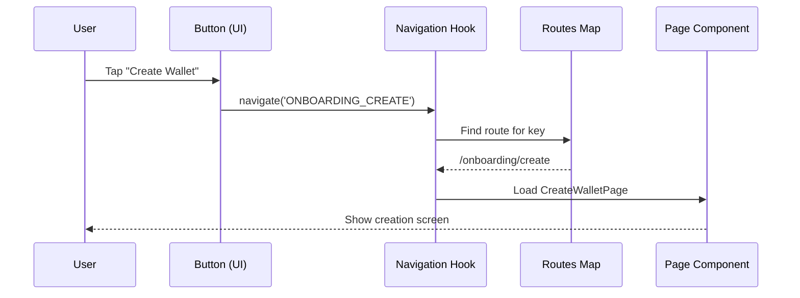

# Chapter 3: Route Navigation System

Navigation organizes Salmon’s screens so users move predictably between onboarding, wallet, and settings without losing state.

## Goals
- Clear, shallow routes for primary flows (onboarding, portfolio, activity, settings).  
- Type-safe params and guards for protected areas.  
- Remember last-known tab and network for smooth returns.  
- Minimal backstack surprises—especially after signing or funding.

## Route design
- **Top-level:** `/onboarding/*`, `/wallet`, `/activity`, `/settings`.  
- **Nested:** `/onboarding/create|recover|password|success`, `/settings/security|network|preferences`.  
- **Guards:** redirect unauthenticated users to onboarding; prompt unlock if wallet is locked.  
- **Deeplinks:** map `salmon://` links to onboarding or wallet routes with analytics.

## Implementation notes
- Use navigation hooks for pushes/pops; avoid manual history mutations.  
- Keep route strings centralized (enum/const) to avoid typos.  
- Persist navigation context (selected account, network) so reconnecting to a dApp restores the right state.  
- After actions like “Send” or “Approve signature,” navigate back to the invoking screen instead of the home tab.

## Testing checklist
- Direct URL to `/wallet` without an unlocked session triggers unlock flow.  
- Switching networks does not drop the backstack unexpectedly.  
- Deeplinks with params (e.g., prefilled address) render safely and sanitize inputs.  
- Back navigation from modal-like flows (seed quiz, password prompt) works on both mobile and desktop.

## Tips for maintainers
- Keep a single navigation provider; avoid nesting routers that drift out of sync.  
- Centralize transition animations so modal sheets and full pages feel unified.  
- Log route-level errors to catch broken links after refactors.

Imagine your app as a big house with many rooms: the onboarding room for new users, the wallet room for balances, and the settings room for tweaks. Without a navigation system, jumping between rooms would be chaotic—like wandering hallways with no doors or signs. Users might get stuck or frustrated, especially in a wallet app where quick access to transactions or NFTs is key.

Our central use case: A new user taps "Create a Wallet" on the welcome screen and smoothly slides to the creation page, where they enter details and navigate back to the wallet overview if needed. This system acts like a GPS: it maps out paths (routes), handles "detours" (like passing account IDs as parameters), and ensures safe travels between screens. For beginners, think of it as labeled doors between rooms—tap one, and you're there, with info like "room 123" passed along if required. By the end, you'll see how this glues your app together, using React Router for web or React Navigation for native apps.

## Key Concepts in the Route Navigation System

We'll unpack this like planning a road trip: first the map (routes), then the GPS tool (navigation hook), and finally the engine (builder). Each piece is simple and reusable, defined in files like `routes/app-routes.js`.

### 1. Defining Routes: Your App's Map
Routes are like addresses for each screen—unique paths like `/wallet` or `/onboarding/create`. Each route links to a page component and can include "wildcards" for details, like `/token/:tokenId` (the `:tokenId` is a param, like passing a room number).

In a file like `src/pages/Onboarding/routes.js`, routes are listed as an array:

```javascript
// Simplified from src/pages/Onboarding/routes.js
export const ROUTES_MAP = {
  ONBOARDING_CREATE: 'ONBOARDING_CREATE',
};

const routes = [
  {
    key: ROUTES_MAP.ONBOARDING_CREATE,
    name: 'onboardingCreate',
    path: 'create',
    route: '/onboarding/create',
    Component: CreateWalletPage,  // The screen to show
  },
];
```

**What happens here?** Input: A list of objects with path, name, and Component. Output: When the app matches a URL like `/onboarding/create`, it loads `CreateWalletPage`. No params here, but for our use case, tapping "Create" builds this URL. Analogy: Like pinning locations on a map—each pin says "show this room at this address."

### 2. The Navigation Hook: Your GPS for Moving Around
To actually travel between routes, use `useNavigation`—a handy tool that creates links or triggers jumps. It's like saying "go to the wallet room" from anywhere.

In a button on the welcome screen:

```javascript
// Simplified from src/pages/Onboarding/SelectOptionsPage.js
import { useNavigation } from '../../routes/hooks';

const SelectOptionsPage = () => {
  const navigate = useNavigation();  // Get the GPS tool

  return (
    <GlobalButton
      title="Create a Wallet"
      onPress={() => navigate('ONBOARDING_CREATE')}  // Jump to create route
    />
  );
};
```

**What happens here?** Input: A route key like `'ONBOARDING_CREATE'` and optional params (e.g., `{id: '123'}`). Output: The app changes the URL to `/onboarding/create` and loads that screen. In our use case, this takes the user from welcome to creation without reloading the whole app—smooth like a slide door. For params, imagine navigating to a token detail: `navigate('TOKEN_DETAIL', {tokenId: 'ETH'})` builds `/token/ETH`.

**Beginner tip:** Import it once per page; it uses React's `useNavigate` under the hood for web.

### 3. Handling Params: Passing Notes Between Rooms
Params let you carry info, like an account ID, to the next screen. The hook builds the path automatically, and `useParams` grabs it on arrival.

On a token list screen, navigating with param:

```javascript
// Example in a token card
navigate('TOKEN_DETAIL', { tokenId: selectedToken.id });  // Builds /token/abc123
```

Then, in the detail page:

```javascript
// Simplified in TokenDetailPage.js
import { useParams } from 'react-router-dom';  // From React Router

const TokenDetailPage = () => {
  const { tokenId } = useParams();  // Grabs 'abc123' from URL

  return <GlobalText>{`Details for ${tokenId}`}</GlobalText>;  // Uses it
};
```

**What happens here?** Input: Param in URL. Output: The page reads it to show specific data, like token balance. Analogy: Handing a note saying "show room for guest #456"—the room knows who to prepare for.

### 4. Nested Routes: Sub-Rooms in Bigger Sections
For sections like settings (with sub-pages for accounts or NFTs), routes nest under parents. Like a house wing with bedrooms—enter "settings," then branch to "accounts/:id".

From `src/pages/Wallet/routes.js`:

```javascript
// Simplified nesting
{
  key: 'WALLET_SETTINGS',
  path: 'settings/*',  // * means "any sub-path"
  route: '/wallet/settings',
  Component: SettingsSection,  // Wrapper for subs
},
// Subs added via getRoutesWithParent utility
```

**What happens here?** Input: Parent route with `/*`. Output: App matches `/wallet/settings/accounts` to a sub-route, loading the right component. In our use case, from wallet overview, tap settings to enter the wing, then accounts for details.

## Step-by-Step Walkthrough: Navigating from Welcome to Wallet

Using our central use case, here's how navigation flows—like following GPS directions:

1. **User taps button** → Calls `navigate('ONBOARDING_CREATE')` in the welcome page.
2. **Hook builds URL** → Matches key to `/onboarding/create` in routes.
3. **App loads component** → Renders `CreateWalletPage` with any params.
4. **User finishes** → Next `navigate` to `'WALLET_OVERVIEW'`, passing account ID if needed.
5. **Back navigation** → Built-in browser "back" or explicit `navigate(-1)` returns.

This ensures users flow from onboarding to wallet seamlessly, pulling UI components from the library for buttons.

For a visual of the use case navigation:



**Explanation:** Four steps, four players—user action triggers the chain, ending at the new page. No data loss; params travel along.

## Deeper Dive: How It All Works Under the Hood

Internally, the system starts in `src/AppRoutes.js`, which decides the entry point (welcome if no accounts, wallet if ready—tying into [Onboarding Flow](01_onboarding_flow.md) and later [AppContext](04_appcontext.md)).

It uses `RoutesBuilder` to render:

```javascript
// Simplified from src/routes/RoutesBuilder.js
import { Routes, Route } from 'react-router-dom';

const RoutesBuilder = ({ routes, entry }) => {
  const EntryComponent = getRouteComponent(routes, entry);  // Picks starting page

  return (
    <Routes>
      {EntryComponent && <Route path="/" element={<EntryComponent />} />}
      {routes.map(({ path, Component }) => (
        <Route key={path} path={path} element={<Component />} />
      ))}
    </Routes>
  );
};
```

**Explanation:** Input: Array of routes and entry key. Output: React Router's `<Routes>` that matches URL to components. Like a switchboard—URL `/onboarding/create` flips to that route. The `getRouteComponent` utility (in `utils.js`) finds the Component by key.

The hook in `src/routes/hooks.js` powers jumps:

```javascript
// Simplified from src/routes/hooks.js
import { useNavigate } from 'react-router-dom';
import { getRoute } from './utils';

export const useNavigation = () => {
  const navigate = useNavigate();
  return (to, params) => {
    const toRoute = getRoute(globalRoutes, to);  // Find route by key
    if (toRoute) {
      const fullPath = buildRouteWithParams(toRoute.route, params);  // Add params
      navigate(fullPath);  // Go there
    }
  };
};
```

**Explanation:** `globalRoutes` is the full map (merged from all sections like onboarding or wallet in `app-routes.js`). `buildRouteWithParams` swaps `:id` with values (e.g., `/token/:id` becomes `/token/ETH`). For native, it swaps to React Navigation stacks/tabs—cross-platform without extra work.

Nesting uses `getRoutesWithParent` in `utils.js` to prefix subs (e.g., settings routes get `/wallet/settings/` added). This keeps the map tidy, avoiding duplicate code.

**Beginner tip:** Errors? Check console for "route not found"—means a key mismatch. Update `ROUTES_MAP` constants to add new paths.

## Wrapping Up: Smooth Travels Between Screens

Awesome work! You've now mapped out the Route Navigation System: routes as addresses, the `useNavigation` hook as your GPS, and builders handling the heavy lifting for seamless jumps—like guided doors in a house. This powers flows from [Onboarding Flow](01_onboarding_flow.md) to wallet views, using [UI Component Library](02_ui_component_library.md) buttons to trigger moves.

Next, we'll see how shared data (like user accounts) flows across these screens: [AppContext](04_appcontext.md).

---
