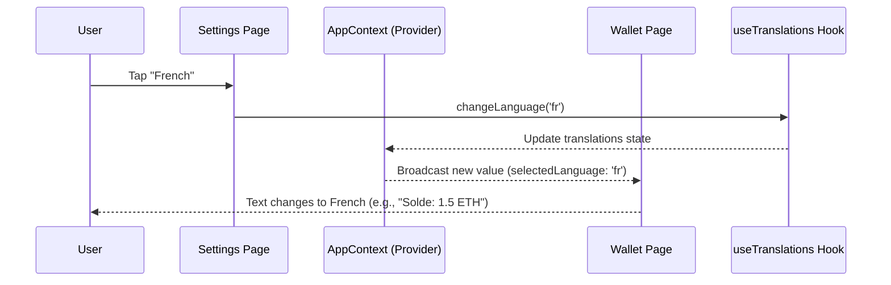

# Chapter 4: AppContext

AppContext is the shared state layer that keeps accounts, networks, preferences, and session status in sync across Salmon.

## Responsibilities
- Hold active account, balances, tokens, and network.  
- Expose actions to add/remove/rename accounts and switch networks.  
- Track lock/unlock state and surface session timeouts.  
- Provide user prefs (language, theme) to UI components.

## Design principles
- Single source of truth; avoid duplicating wallet state elsewhere.  
- Immutable updates to keep renders predictable.  
- Derived selectors (e.g., `activeBalance`, `hasPendingSignatures`) to reduce repeated logic.  
- Memoize context values to avoid re-render storms.

## Core API (examples)
- `accounts`, `activeAccountId`, `setActiveAccount(id)`.  
- `network`, `setNetwork(net)`, `availableNetworks`.  
- `preferences` (language, theme), `setPreference(key, value)`.  
- `lock()`, `unlock(password)`, `isLocked`.

## Persistence interactions
- On init: load accounts + encrypted mnemonics from storage, then unlock if a password cache exists.  
- On change: persist account list and prefs; lock-sensitive data remains encrypted.  
- On lock: clear sensitive in-memory state but keep non-sensitive prefs.

## Testing checklist
- Switching accounts updates balances and recent activity views.  
- Locking clears access to mnemonics and signing; unlocking restores.  
- Language/theme changes propagate instantly without page reload.  
- Context remains stable when navigating between tabs.

## Tips for maintainers
- Keep context small: expose intent-based actions instead of raw setters where possible.  
- Add analytics hooks at the action layer, not inside UI components.  
- When adding fields, document defaults and persistence behavior.

## Key Concepts in AppContext

Let's break this down like setting up a family group chat: first the chat room (Context), then adding members (Provider), and finally checking messages (hooks). It's built on React's Context API, but we'll keep it simple—no deep React theory needed.

### 1. React Context Basics: The Shared Bulletin Board
React Context is like a magic box where you store app-wide info (state) that any component can access, without passing props through every level. In our app, AppContext is this box, holding things like the active wallet account or hidden balances.

To use it, wrap your app in a Provider (the box owner) and "subscribe" in components with a hook. Analogy: The Provider posts the daily news; components read it without asking parents.

No code here yet—we'll see it in action next.

### 2. AppProvider: The Central Command Center
AppProvider is the boss that creates and manages the Context. It combines data from various hooks (like accounts from useAccounts or translations from useTranslations) into one big package, then shares it via Context.Provider. Think of it as the radio station DJ mixing tracks (data sources) into a broadcast.

From `src/AppProvider.js`, here's a simplified setup:

```javascript
// Simplified from src/AppProvider.js - Creating the Context
import React, { createContext } from 'react';
import useAccounts from './hooks/useAccounts'; // Gets wallet data
import useTranslations from './hooks/useTranslations'; // Gets language

export const AppContext = createContext(); // Creates the shared box

const AppProvider = ({ children }) => {
  const [accountsState, accountsActions] = useAccounts(); // e.g., { activeAccount, ... }
  const { selectedLanguage, ...translationsState } = useTranslations(); // e.g., { languages, ... }

  const value = [ // Bundle state and actions into one package
    { ...accountsState, ...translationsState }, // All shared data
    { ...accountsActions, changeLanguage: translationsState.changeLanguage }, // All methods
  ];

  return (
    <AppContext.Provider value={value}> // Share the package app-wide
      {children} // Your screens go here
    </AppContext.Provider>
  );
};
```

**What happens here?** Input: Child components (your whole app). Output: The Provider fetches data from hooks (e.g., active account with balance) and bundles it with actions (e.g., switch account). Any descendant component can now access this without props. In our use case, it loads accounts after onboarding and shares the active wallet instantly.

**Beginner tip:** Wrap `<AppProvider>` around `<RoutesProvider>` in your main App.js to make it available everywhere, like plugging in the radio for the whole house.

### 3. Using the Hook: Reading and Updating from Anywhere
To access the shared state, use `useContext(AppContext)` in any component. It gives you the state (data) and actions (methods), like getting the bulletin board notes and a pen to add your own.

In a wallet screen showing balance:

```javascript
// Simplified example in a WalletPage.js - Using the Context
import { useContext } from 'react';
import { AppContext } from '../AppProvider'; // Import the shared box

const WalletPage = () => {
  const [state, actions] = useContext(AppContext); // Subscribe: get data and methods
  const { activeAccount } = state; // Read active wallet (e.g., { name: 'My Wallet', balance: 1.5 })
  const { changeAccount } = actions; // Method to switch

  return (
    <GlobalText>{activeAccount?.name} Balance: ${activeAccount?.balance}</GlobalText>
    <GlobalButton title="Switch Account" onPress={() => changeAccount('new-id')} />
  );
};
```

**What happens here?** Input: Nothing—the hook pulls from Context. Output: State like `activeAccount` (wallet details) updates the UI automatically when it changes (e.g., after a transaction). In our use case, tapping "Switch Account" calls the action, updating the active wallet across the app—no refresh needed. For language, `state.selectedLanguage` shows "English," and `actions.changeLanguage('es')` updates all text.

**Explanation:** React re-renders components when Context value changes, like the bulletin board lighting up new notes. This avoids prop drilling: Instead of passing accounts from parent > child > grandchild, everyone reads directly.

### 4. Integrating Hooks: Building the Data Mix
AppContext doesn't store data itself—it pulls from specialized hooks like useAccounts (for wallets) or useAddressbook (for contacts). These hooks handle the details (e.g., loading from storage, covered in [Storage and Persistence Layer](05_storage_and_persistence_layer.md)), and AppProvider mixes them.

From the simplified AppProvider above, see how `useAccounts()` provides `activeAccount` (e.g., Input: Stored wallet data; Output: Object with networks, tokens, balance via blockchain calls).

## Step-by-Step Walkthrough: Sharing Wallet Data in the Use Case

Using our central use case, here's how AppContext flows data—like a relay race passing the baton (wallet info) smoothly:

1. **App starts** → AppProvider initializes, calls hooks to load data (e.g., accounts from storage, language from prefs).
2. **User navigates to wallet** → WalletPage uses `useContext` to grab `activeAccount` and display balance.
3. **User switches language** → Settings calls `changeLanguage('fr')`, updating Context value; all pages re-render with French text.
4. **Balance updates** → A transaction happens (via blockchain methods in useAccounts); state changes, UI refreshes everywhere.
5. **Logout** → Actions call `logout()`, clearing accounts; app shows onboarding again.

For a visual of the language switch in our use case:



**Explanation:** User action triggers an action in one place (Settings); Context broadcasts the change, so Wallet (and others) update automatically. Only 4 steps—efficient, like a group chat ping.

## Deeper Dive: Under the Hood in AppProvider

Internally, AppProvider orchestrates everything in `src/AppProvider.js`. It uses React's `useReducer` for simple app state (e.g., logged in? hide balance?) and waits for hooks to be "ready" before showing screens.

Step-by-step without code: On app load, it checks if accounts/translations are loaded (via `useEffect`). If yes, hides splash screen and sets `isLogged: true` if there's an active account. For logout, it calls `removeAllAccounts()` from useAccounts, then updates state.

Simplified reducer for login state:

```javascript
// From src/AppProvider.js - Handling login/logout
const initialState = { isLogged: false, ready: false };
const reducer = (state, action) => {
  switch (action.type) {
    case 'SET_LOGGEDIN': return { ...state, isLogged: action.value };
    case 'INITIATE_DONE': return { ...state, ready: true, isLogged: !!action.activeAccount };
    default: return state;
  }
};

const [appState, dispatch] = useReducer(reducer, initialState);
// Later: dispatch({ type: 'INITIATE_DONE', activeAccount: accountsState.activeAccount });
```

**Explanation:** Input: Actions like `SET_LOGGEDIN`. Output: Updated state (e.g., `ready: true` shows routes). It merges with hook states (e.g., `...accountsState`) in the Provider value. For security, if locked (password needed), it shows LockedPage instead of wallet.

Hooks like useAccounts (in `src/hooks/useAccounts.js`) derive `activeBlockchainAccount` from stored data—e.g., Input: Network ID; Output: Cached account with methods like `getBalance()` (fetches from blockchain, but cached for speed). Translations hook loads i18n resources. This mix ensures AppContext is always up-to-date, like a DJ queuing the latest tracks.

**Beginner tip:** Errors? If a hook isn't ready, the app shows a skeleton loader (from [UI Component Library](02_ui_component_library.md)). Test by logging `console.log(state)` in a component.

## Wrapping Up: Your App's Shared Brain

Fantastic progress! You've now unlocked AppContext: a React-powered hub that shares wallet data, actions, and settings across your app—like a central radio keeping everyone in sync—eliminating messy prop passing. This powers seamless updates, from balance refreshes to language switches, building on navigation and UI from earlier chapters.

Next, discover how this data gets saved securely: [Storage and Persistence Layer](05_storage_and_persistence_layer.md).

---
