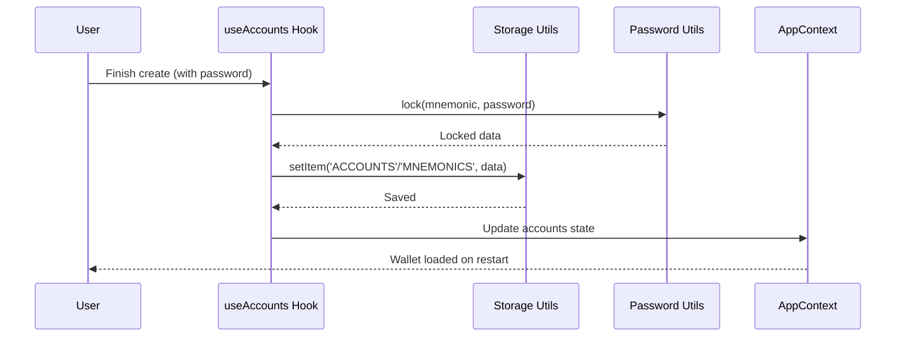

# Chapter 5: Storage and Persistence Layer

The storage layer keeps wallets, mnemonics, and preferences available across sessions while protecting secrets.

## Responsibilities
- Encrypt and persist mnemonics/private data.  
- Persist non-sensitive metadata (accounts, settings, networks) separately.  
- Handle migrations/upgrades between schema versions.  
- Provide simple get/set APIs to AppContext and onboarding.

## Data model
- `MNEMONICS`: encrypted map of accountId → seed.  
- `ACCOUNTS`: array of account metadata (id, name, derivation path, network).  
- `PREFERENCES`: language, theme, analytics opt-in, etc.  
- Version key to trigger migrations.

## Security practices
- Encryption at rest using password-derived keys.  
- Wipe decrypted material from memory on lock/unmount.  
- Avoid writing secrets to logs; gate debug flags behind env checks.  
- On mobile, use secure storage/backed keychain where available.

## Flow
1. On app start, load persisted data.  
2. If encrypted, prompt unlock; else hydrate context directly.  
3. On account changes, write metadata + encrypted seeds atomically.  
4. On lock, drop decrypted cache; keep prefs.

## Testing checklist
- Fresh install: no data loaded, onboarding required.  
- Create account → restart: accounts appear, unlock prompt shown if password set.  
- Migration path upgrades data without loss; invalid data fails gracefully.  
- Lock/unlock cycle removes decrypted seeds from memory.

## Tips for maintainers
- Keep persistence boundaries clear: sensitive vs non-sensitive.  
- Batch writes to reduce churn; debounce preference updates.  
- Document new keys and include migration steps when changing formats.

## Key Concepts in the Storage and Persistence Layer

We'll unpack this like organizing a backpack for a trip: essentials first (basic saving), then locks (encryption), and helpers (temporary stashes or hooks). It's all in utils files under `src/utils/`, keeping things modular and platform-smart (web, mobile, or browser extension).

### 1. Platform-Specific Storage: The Basic Filing Cabinet
Storage picks the right "drawer" based on where your app runs—like using a desk drawer for home (web's localStorage) or a phone's secure vault for mobile (AsyncStorage). It handles saving simple data like account lists or user preferences as JSON strings.

To save an account after onboarding:

```javascript
// Simplified from src/hooks/useAccounts.js - Saving accounts
import storage from '../utils/storage';

const saveAccounts = async (accounts) => {
  await storage.setItem('ACCOUNTS', accounts); // Save as JSON
  // Loads like: const loaded = await storage.getItem('ACCOUNTS');
};

saveAccounts([{ id: '1', name: 'My Wallet' }]); // Input: Array of account objects
```

**What happens here?** Input: A key like `'ACCOUNTS'` and data (e.g., your wallet list). Output: Data gets stored locally; on next load, `getItem` pulls it back exactly as saved. In our use case, after creating a wallet, this saves the account details. Analogy: Like jotting a shopping list on paper—easy to tuck away and grab later. For web, it's `localStorage.setItem`; for native apps, it's encrypted by default to dodge app crashes wiping data.

No worries about formats—`JSON.stringify` and `parse` handle the conversion automatically under the hood.

### 2. Encryption for Sensitive Data: The Secure Lock
Not all data is casual; seed phrases (mnemonics) are like house keys—lose them, and poof, your funds are gone. The layer uses password-based encryption (via `lock/unlock` utils) to scramble sensitive info before storing, only unlocking with the right password.

From the password step in onboarding:

```javascript
// From src/utils/password.js - Locking a mnemonic
import { lock } from '../utils/password';

const encryptMnemonic = async (mnemonic, password) => {
  const locked = await lock({ seed: mnemonic }, password); // Input: Data + password
  await storage.setItem('MNEMONICS', locked); // Save encrypted version
};

encryptMnemonic('abandon ability able...', 'mySecretPass'); // Outputs locked object
```

**What happens here?** Input: Plain data (e.g., `{ seed: 'word1 word2...' }`) and a password. Output: A scrambled "locked" object saved to storage; trying to load without the password throws an error like "Incorrect password." In our use case, during onboarding, the user's password encrypts the seed phrase right after validation. Unlocking happens on app start: `unlock(loaded, password)` decrypts it for the [AppContext](04_appcontext.md). Analogy: Like putting valuables in a safe—only your combo opens it. It uses strong crypto (PBKDF2 for key derivation, NaCl for boxing) to resist hackers, with salts and nonces for extra safety.

**Beginner tip:** Always encrypt seeds; never store them plain. The keys are from `STORAGE_KEYS` like `'MNEMONICS'` for organization.

### 3. Stash Utils: Temporary Storage for Quick Notes
For short-term stuff like a password during login (not worth encrypting yet), use `stash`—a lightweight, in-memory or extension-channel store that clears on app close. It's like a notepad on your desk, not the filing cabinet.

Example for holding a temp password:

```javascript
// From src/utils/stash.js - Temp storage
import stash from '../utils/stash';

const tempSavePassword = async (password) => {
  await stash.setItem('tempPass', password); // Input: Key + value
  // Later: const pass = await stash.getItem('tempPass');
};

tempSavePassword('temp123'); // Outputs: Value stored temporarily
```

**What happens here?** Input: Simple key-value pairs. Output: Data held in RAM (web/native) or a secure channel (extensions), gone when the app restarts. In our use case, stash might hold an entered password during unlock before decrypting accounts. Analogy: Sticky notes for reminders—handy but not permanent. For extensions, it uses Chrome messaging to avoid localStorage limits.

### 4. Integration Hooks: Easy Access for Accounts
Hooks like `useAccounts` (from [AppContext](04_appcontext.md)) tie storage together, loading/saving automatically. It's the "librarian" that fetches your filed data on demand.

In a component after onboarding:

```javascript
// Simplified from src/hooks/useAccounts.js - Loading on app start
import { useState, useEffect } from 'react';
import storage from '../utils/storage';
import { unlock } from '../utils/password';

const useAccounts = () => {
  const [accounts, setAccounts] = useState([]);

  useEffect(() => {
    const load = async () => {
      const saved = await storage.getItem('ACCOUNTS'); // Load accounts
      const lockedMnemonics = await storage.getItem('MNEMONICS');
      if (lockedMnemonics && password) { // Assume password from user
        const mnemonics = await unlock(lockedMnemonics, password);
        setAccounts([...saved, ...mnemonics]); // Merge and set
      }
    };
    load();
  }, []);

  return [accounts, { addAccount: saveAccounts }]; // Output: State + actions
};
```

**What happens here?** Input: Triggers on app load (via `useEffect`). Output: Populated `accounts` array ready for [AppContext](04_appcontext.md), with methods to add/save. In our use case, on restart, it decrypts and loads your wallet, showing "My Wallet" with balance. Analogy: Like a auto-reminder app that pulls your to-do list each morning.

## Step-by-Step Walkthrough: Saving a Wallet in the Use Case

Using our central use case, here's how storage persists the new wallet—like archiving a document after writing it:

1. **User finishes onboarding** → Password encrypts the mnemonic via `lock()`.
2. **Save to storage** → `storage.setItem` files accounts and locked seeds.
3. **App closes/reopens** → On start, `useAccounts` loads via `getItem` and decrypts with password.
4. **Data flows to context** → Loaded accounts update [AppContext](04_appcontext.md), showing the wallet.
5. **User sees persistence** → Balance and name appear without re-setup.

For a visual of saving after onboarding:



**Explanation:** User action kicks off encryption, then storage files it away. On reload, reverse: load > decrypt > share. Simple chain—5 players, no data lost.

## Deeper Dive: Under the Hood in the Utils

Internally, the layer starts in `src/utils/storage.js`, which detects the platform (web, native, extension via `isExtension()`) and picks the right implementation—like choosing a backpack size for your trip.

For web (`storage.window.js`):

```javascript
// Simplified from src/utils/storage.window.js
const storage = {
  setItem: async (key, value) =>
    window.localStorage.setItem(key, JSON.stringify(value)), // Input: Key + data
  getItem: async key => JSON.parse(localStorage.getItem(key) || 'null'), // Output: Parsed data or null
};

export default storage;
```

**Explanation:** Uses browser's localStorage for persistence (survives page refreshes). JSON handles objects/arrays automatically. Errors? Logs and removes bad keys. For native (`storage.native.js`), it swaps to `react-native-encrypted-storage` for phone security—same API, different engine. Extensions use Chrome's `storage.local` (`storage.extension.js`) for sync across tabs.

Encryption in `src/utils/password.js` derives keys securely:

```javascript
// Core from password.js - Key derivation
import { pbkdf2 } from 'crypto-browserify'; // Or native version

const deriveKey = async (password, salt) => 
  new Promise((res, rej) => 
    pbkdf2(password, salt, 100000, 32, 'sha256', (err, key) => 
      err ? rej(err) : res(key) // Input: Password + salt; Output: 32-byte key
    )
  );
```

**Explanation:** PBKDF2 "stretches" the password (100k iterations) to make brute-force hard, like turning a simple lock into a vault. Then `secretbox` encrypts with the key + random nonce/salt. Unlocking reverses it, checking for decryption success. Platform tweaks: Native uses `react-native-fast-crypto` for speed; web uses browserify shims.

Stash (`src/utils/stash.js`) routes similarly: Native uses a Map (in-memory), web a window var, extensions Chrome messages—all async and promise-based.

Keys are centralized in `src/utils/storageKeys.js` (e.g., `ACCOUNTS: 'accounts'`) to avoid typos—like labeled folders. Upgrades (old data formats) run via `runUpgrades` in hooks, migrating seamlessly.

**Beginner tip:** Test by clearing storage (e.g., `storage.clear()`) and reloading—watch accounts vanish until re-saved.

## Wrapping Up: Your App's Secure Memory Bank

Whew, you've now mastered the Storage and Persistence Layer: a smart, encrypted filing system that saves wallets and settings across sessions, blending platform storage, locks for secrets, temp stashes, and hooks for easy use—like a reliable diary for your app's life story. This ensures onboarding gains stick, powering the shared state in [AppContext](04_appcontext.md) without resets.

Ready to make your app speak multiple languages? Head to the next chapter: [Translation System](06_translation_system.md).

---
