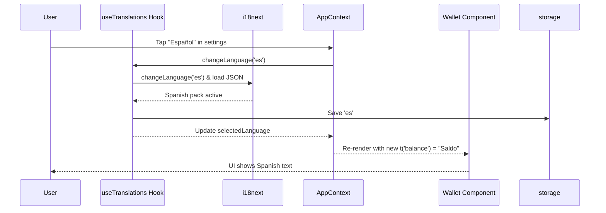

# Chapter 6: Translation System

The translation system localizes Salmon so copy, errors, and prompts adapt to each user’s language without code changes.

## Goals
- Centralize strings with stable keys; avoid hardcoded UI text.  
- Support runtime language switching without reload.  
- Provide fallbacks and interpolation for dynamic values.  
- Keep error messages short, actionable, and translated.

## Structure
- Namespaced JSON/YAML dictionaries per language (e.g., `wallet.create_wallet`, `errors.network_unavailable`).  
- Loader that fetches dictionaries on app start and caches them.  
- Hook/HOC to expose `t(key, params)` and current locale to components.  
- Fallback to default locale when keys are missing; log missing keys in dev.

## Patterns
- Prefer declarative keys (`actions.continue`) over inline text.  
- Interpolate with `{amount}` style placeholders; avoid string concatenation.  
- Keep capitalization in translations, not in code.  
- Pair translations with accessibility labels where needed.

## Testing checklist
- Switching languages updates visible text immediately.  
- Missing keys surface a clear dev warning and fallback text.  
- RTL locales render correctly if added; layout remains usable.  
- Error messages remain concise across locales.

## Tips for maintainers
- Add new keys next to the feature, then sync all locale files.  
- Avoid duplicating similar phrases—reuse keys to stay consistent.  
- When refactoring features, delete unused keys to prevent drift.

## Why Do We Need a Translation System?

Picture this: A user from Spain opens your wallet app and sees everything in English—frustrating, right? They tap settings to switch to Spanish, and suddenly buttons say "Crear Billetera" instead of "Create Wallet," with error messages like "Contraseña incorrecta" for "Wrong password." This personalization boosts trust and usability, especially for non-English speakers handling sensitive crypto.

Our central use case: After onboarding, a user in settings selects Spanish. The app loads Spanish translations from JSON files, updates the UI instantly (e.g., wallet balance shows "Saldo" instead of "Balance"), and saves the choice persistently so it sticks on restart—via the [Storage and Persistence Layer](05_storage_and_persistence_layer.md). For beginners, it's like giving your app a universal translator earpiece: Load word dictionaries, swap languages with a hook, and sprinkle `t('key')` in components to pull the right words. By the end, you'll know how to make your app bilingual (or more) without rewriting screens.

## Key Concepts in the Translation System

We'll break this down like building a simple phrasebook: first the dictionary (i18next setup), then the selector (hook for language state), and finally the lookup (using `t()` in UI). It's powered by the i18next library, keeping code light and React-friendly.

### 1. i18next Setup: Your App's Dictionary
i18next loads JSON files as language packs—like pocket dictionaries for English, Spanish, etc. Each file has key-value pairs: e.g., `'wallet.create': 'Create Wallet'` in English, `'Crear Billetera'` in Spanish.

From `src/translations/index.js`, the basic init:

```javascript
// Simplified from src/translations/index.js
import i18n from 'i18next';
import { initReactI18next } from 'react-i18next';
import enTranslation from './en/translation'; // English JSON: { wallet: { create: 'Create Wallet' } }
import esTranslation from './es/translation'; // Spanish JSON: { wallet: { create: 'Crear Billetera' } }

const resources = {
  en: { translation: enTranslation },
  es: { translation: esTranslation },
};

i18n.use(initReactI18next).init({
  resources,
  lng: 'en', // Default: English
  fallbackLng: 'en', // Backup if language missing
});
```

**What happens here?** Input: JSON resources and default language ('en'). Output: i18next is ready; it loads the English pack on start. In our use case, add more languages by importing new JSONs—keys stay the same, values translate. Analogy: Like stacking dictionaries in a backpack; the app picks one based on user choice. No server needed—local files keep it fast and private.

### 2. useTranslations Hook: Managing Language State
This custom hook (like a radio tuner) loads/saves the user's language, initializes i18next, and provides a `changeLanguage` method. It ties into [AppContext](04_appcontext.md) for app-wide sharing and [Storage and Persistence Layer](05_storage_and_persistence_layer.md) to remember preferences.

From `src/hooks/useTranslations.js`:

```javascript
// Simplified from src/hooks/useTranslations.js
import { useState, useEffect } from 'react';
import i18n from '../translations';
import storage from '../utils/storage';
import STORAGE_KEYS from '../utils/storageKeys';

const useTranslations = () => {
  const [selected, setSelected] = useState('en');
  const [loaded, setLoaded] = useState(false);

  useEffect(() => {
    if (!loaded) {
      storage.getItem(STORAGE_KEYS.LANGUAGE).then(lang => {
        const lng = lang || 'en';
        i18n.init({ lng, resources: /* loaded from index.js */ });
        setSelected(lng);
        setLoaded(true);
      });
    }
  }, [loaded]);

  return { selected, loaded, changeLanguage: async lng => {
    await storage.setItem(STORAGE_KEYS.LANGUAGE, lng);
    i18n.changeLanguage(lng);
    setSelected(lng);
  } };
};
```

**What happens here?** Input: On app start, pulls saved language (or defaults to 'en'). Output: Sets state (`selected: 'en'`) and initializes i18next with the pack; `loaded: true` signals ready. For our use case, call `changeLanguage('es')` in settings—it saves to storage, swaps the dictionary, and updates the UI. Analogy: Like tuning a radio station; the hook remembers your favorite and switches tunes instantly.

### 3. Using {t('key')} in Components: Pulling Translated Strings
Components access translations via a Higher-Order Component (HOC) `withTranslation`, which injects a `t` function. Use it like `t('wallet.create')` to get the string for the current language.

In a welcome button, from `src/pages/Welcome/WelcomePage.js`:

```javascript
// Simplified from src/pages/Welcome/WelcomePage.js
import { withTranslation } from '../../hooks/useTranslations';

const WelcomePage = ({ t }) => (  // t is injected by HOC
  <GlobalButton
    title={t('wallet.create_wallet')}  // Outputs: "Create a Wallet" (en) or "Recuperar Billetera" (es)
    onPress={() => navigate('/onboarding/create')}
  />
);

export default withTranslation()(WelcomePage);  // Wraps to provide t
```

**What happens here?** Input: Key like `'wallet.create_wallet'`. Output: The translated string from the active dictionary (e.g., "Crear Billetera" in Spanish), rendered in the button. In our use case, after switching languages, all `t()` calls update automatically on re-render. Analogy: Like looking up a word in your current dictionary—swap books, and lookups change. For errors: `t('error.invalid_password')` becomes "Contraseña inválida."

### 4. Integrating with AppContext: Sharing Translations App-Wide
The hook feeds into [AppContext](04_appcontext.md) (see `src/AppProvider.js`), bundling `selectedLanguage` and `changeLanguage` for any screen to access—e.g., settings calls it to switch, and wallet UI updates via `t()`.

## Step-by-Step Walkthrough: Switching to Spanish in the Use Case

Using our central use case, here's how translations adapt the app—like flipping a language switch in a tour guide app:

1. **App starts** → `useTranslations` loads saved language ('en') from storage, initializes i18next with English JSON.
2. **User goes to settings** → Component uses Context to call `changeLanguage('es')`; saves 'es' and loads Spanish JSON.
3. **UI updates** → Screens re-render; `t('wallet.balance')` now shows "Saldo" instead of "Balance" (e.g., in wallet view).
4. **Persistent** → On restart, storage pulls 'es', so Spanish loads by default—no reset to English.
5. **Error handling** → If a key's missing in Spanish, falls back to English for that string only.

For a visual of switching languages:



**Explanation:** User action triggers the hook, which updates i18next and storage. Context broadcasts, so components like wallet refresh—smooth, with just 5 steps like a quick channel change.

## Deeper Dive: Under the Hood in the Translation System

Internally, the system starts in `src/translations/index.js`, exporting i18n as a singleton (one instance app-wide). JSONs like `en/translation.json` are flat or nested objects—e.g., `{ "wallet": { "create": "Create Wallet" } }`—loaded lazily to save memory.

In `src/hooks/useTranslations.js`, the `useEffect` runs once: It fetches from `STORAGE_KEYS.LANGUAGE` (e.g., 'language' key), inits i18next with `compatibilityJSON: 'v3'` for safe key handling (ignores extra dots), and sets interpolation to false (no variable escaping needed here). The `changeLanguage` is async for storage, ensuring the UI waits—no flickering.

The HOC in the hook (`withTranslationHOC` from i18next) wraps components, injecting `t` via React context—e.g., Input: Key; Output: Scans active resources for match, falls back if missing. In [AppProvider](04_appprovider.js), it spreads `{ selectedLanguage, changeLanguage }` into Context value, so hooks like `useContext(AppContext)` grab them easily.

**Beginner tip:** Missing translation? Console warns; add to JSON. Test by forcing `changeLanguage('es')` in dev tools—watch buttons morph!

## Wrapping Up: Your App Goes Global

You've now got the Translation System down: i18next dictionaries for words, a hook for state and switching, `t('key')` for easy lookups, and ties to [AppContext](04_appcontext.md) for sharing—all making your app feel at home in any language, like a friendly translator in your pocket. This personalizes the wallet experience post-onboarding, with persistent choices.

Next, we'll dive into handling blockchain accounts smartly: [Blockchain Account Abstraction](07_blockchain_account_abstraction.md).

---
