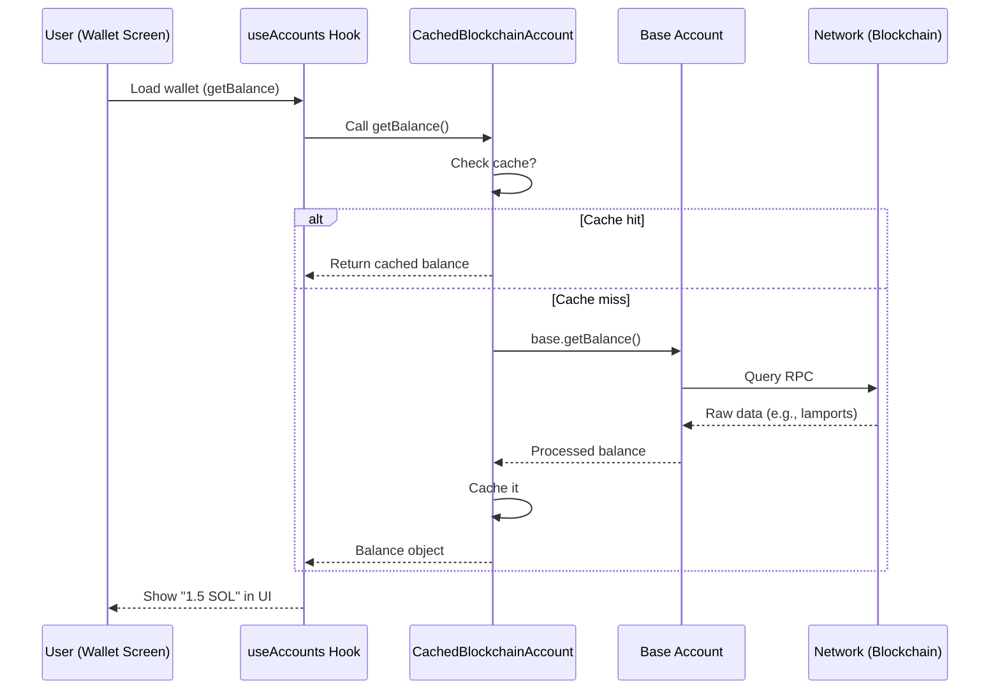

# Chapter 7: Blockchain Account Abstraction

Account abstraction unifies chain-specific logic so Salmon can fetch balances, build transactions, and sign requests through one interface.

## Goals
- One API for accounts regardless of chain/network.  
- Clean separation between UI and RPC/wallet internals.  
- Predictable fee estimation and simulation before signing.  
- Safer defaults (e.g., block unsupported programs, validate destinations).

## Interface outline
- `getAccounts()`, `getActiveAccount()`, `setActiveAccount(id)`.  
- `fetchBalance(accountId, network)`, `fetchTokens(accountId)`.  
- `buildTransaction({ instructions, feePayer, recentBlockhash })`.  
- `simulateTransaction(tx)` and `signAndSend(tx)`.

## Solana specifics
- Default to mainnet; allow devnet/test validators for QA.  
- Use connection pooling and retry policies to avoid rate limits.  
- Include program allow/deny lists where possible to flag risky calls.  
- Normalize token metadata (decimals, symbols) before reaching UI.

## Testing checklist
- Balance/token fetch works across networks; errors surface cleanly.  
- Simulation catches obvious failures before prompting the user.  
- Signing rejects malformed/unsupported instructions.  
- Switching networks updates connection targets without stale data.

## Tips for maintainers
- Keep transport/config pluggable so RPC endpoints can rotate without code churn.  
- Log transaction hashes on send for support/debug (avoid logging payloads).  
- Add metrics around simulation vs send failures to spot integration issues.

## Why Do We Need Blockchain Account Abstraction?

Blockchain interactions can be tricky: Solana uses "public keys" differently than Ethereum's "addresses," and fetching NFTs or swaps varies per network. For beginners, it's like trying to plug in devices from around the world without adapters—frustrating and error-prone.

Our central use case: A user opens their wallet and sees their token balance (e.g., 1.5 SOL on Solana). The app calls a simple method like `getBalance()` on the active account, and it works seamlessly, whether on Solana, Ethereum, or others. Behind the scenes, it fetches real blockchain data, caches it for speed (no repeated network pings), and handles errors gracefully. By the end of this chapter, you'll know how to use this abstraction in hooks like `useAccounts` to power wallet screens, solving our use case with minimal code. Think of it as a "universal adapter" that turns complex blockchain ops into friendly function calls.

## Key Concepts in Blockchain Account Abstraction

We'll break this down like building a simple robot assistant: first the base (raw blockchain access), then the wrapper (abstraction layer), and finally caching (speed boost). Everything lives in classes like `BlockchainAccount` (from `salmon-wallet-adapter`) and our custom `CachedBlockchainAccount`.

### 1. The Base Account: Raw Connection to the Blockchain
At the core, a `BlockchainAccount` is like a direct phone line to one chain (e.g., your Solana wallet on a specific network like mainnet). It knows how to derive addresses from your seed phrase, connect to RPC nodes (blockchain servers), and call methods like fetching credits or tokens. Input: Your account details (seed, network). Output: Raw data, like a balance object with amounts in wei (tiny units).

But using it directly? Tedious for multi-chain apps—different syntax per blockchain. We abstract it!

### 2. The Abstraction Layer: One Remote for All Chains
Blockchain Account Abstraction wraps the base into a unified API. Methods like `getBalance()`, `getTokens()`, or `createTransferTransaction()` work the same way across chains. It's like a universal remote: Press "volume up" for any TV, and it figures out the code underneath.

In our use case, when the wallet screen loads, it grabs the active account and calls `activeBlockchainAccount.getBalance()`. Input: Optional token addresses (for specific balances). Output: A balance object (e.g., `{ uiAmount: 1.5, symbol: 'SOL' }`), ready for display. No need to know if it's Solana's SPL tokens or Ethereum's ERC-20—the abstraction handles it.

Here's a simplified peek from `src/hooks/useAccounts.js`, where we create the abstracted account:

```javascript
// From src/hooks/useAccounts.js - Creating the abstraction
const activeBlockchainAccount = useMemo(() => {
  const base = activeAccount?.networksAccounts?.[networkId]?.[pathIndex];
  return base ? new CachedBlockchainAccount(base) : undefined;  // Wraps base
}, [activeAccount, networkId, pathIndex]);

// Later, in a component: activeBlockchainAccount.getBalance() fetches balance
```

**What happens here?** Input: Base account (from seed derivation). Output: A wrapped `CachedBlockchainAccount` object with unified methods. In our use case, this powers the wallet balance card—call once, get Solana or ETH data uniformly. Analogy: Like wrapping gifts in the same paper, regardless of what's inside.

### 3. Caching for Efficiency: Remember, Don't Refetch
Fetching from blockchains costs time and gas (fees). Caching stores results temporarily, like a notepad for quick lookups. `CachedBlockchainAccount` adds this: Methods like `getBalance()` check cache first, then hit the network if needed.

For our use case, when refreshing the wallet, it caches the balance to avoid slow loads. Input: Method call (e.g., `getBalance()`). Output: Cached data if fresh (e.g., under 5 minutes old); otherwise, fresh fetch.

Simplified from `src/accounts/CachedBlockchainAccount.js`:

```javascript
// From src/accounts/CachedBlockchainAccount.js - Cached getBalance
async getBalance(...args) {
  const key = `${this.network.id}-${this.base.getReceiveAddress()}`;  // Unique key
  return cache(key, CACHE_TYPES.BALANCE, () => this.base.getBalance(...args));  // Cache or fetch
}
```

**What happens here?** Input: Args like token addresses. Output: Balance data, speeding up repeated calls (e.g., UI updates). The `cache` util (from `src/utils/cache.js`) stores in memory or localStorage. Analogy: Like checking your fridge before grocery shopping—grab milk if fresh, buy new if not.

### 4. Common Methods: Building Blocks for Wallet Features
Key methods include:
- `getTokens()`: Lists your holdings (e.g., SOL, USDC).
- `createTransferTransaction(toAddress, amount)`: Preps a send (sign later).
- `getAllNfts()`: Fetches owned NFTs.
All return chain-agnostic objects, like `{ address: 'abc...', uiAmount: 1.5 }`.

In our use case, `getBalance()` feeds the token list in [UI Component Library](02_ui_component_library.md) cards.

## Step-by-Step Walkthrough: Fetching Balance in the Use Case

Using our central use case, here's how the abstraction fetches and displays a balance—like a waiter noting your order, checking the kitchen cache, then serving fresh food:

1. **App loads wallet screen** → `useAccounts` hook (from [AppContext](04_appcontext.md)) creates `activeBlockchainAccount`.
2. **Call getBalance()** → Checks cache; if stale, calls base method (e.g., Solana RPC query).
3. **Data ready** → Returns balance object; UI renders it (e.g., "1.5 SOL").
4. **User refreshes** → Cache hit—fast update, no network lag.
5. **Store for persistence** → Saves via [Storage and Persistence Layer](05_storage_and_persistence_layer.md) for offline glimpses.

For a visual of fetching balance:



**Explanation:** User action triggers the hook; abstraction checks cache first, then network. Five steps total—efficient, with fallback to base for chain specifics. Output: UI updates instantly, even on slow connections.

## Deeper Dive: Under the Hood in CachedBlockchainAccount

Internally, the abstraction starts in `src/accounts/CachedBlockchainAccount.js`, a class wrapping the base `BlockchainAccount` from `salmon-wallet-adapter`. It derives your public key from the seed (via `keyPair`), sets the network (e.g., Solana mainnet), and proxies methods.

Non-code walkthrough: On creation, it computes a `baseKey()` (unique ID like "solana-mainnet-YourAddress"). For each method (e.g., `getTokens()`), it generates a cache key, checks `cache()` util—if hit, returns stored; else, calls `this.base.method()`, processes (e.g., convert wei to SOL), caches, and returns. Errors? Logs and retries once.

Simplified constructor and proxy example:

```javascript
// From src/accounts/CachedBlockchainAccount.js - Constructor
class CachedBlockchainAccount {
  constructor(base) {
    this.base = base;  // The raw account
    this.network = base.network;  // e.g., { id: 'solana-mainnet', blockchain: 'SOLANA' }
    this.publicKey = base.publicKey;  // Your address
  }

  baseKey() {  // Unique ID for caching
    return `${this.network.id}-${this.base.getReceiveAddress()}`;
  }

  // Proxy example: getTokens caches the list
  async getTokens() {
    const key = this.baseKey();
    return cache(key, CACHE_TYPES.TOKENS, () => this.base.getTokens());
  }
}
```

**Explanation:** Input to constructor: Base object (with seed-derived keys). Output: Wrapped instance. The `cache(key, type, fetchFn)` (from `src/utils/cache.js`) uses a Map for in-memory storage, expiring after ~5 minutes (tunable). For `getTokens()`, it fetches from RPC (e.g., Solana's `getTokenAccountsByOwner`), normalizes to `{ address, uiAmount, symbol }`, and stores. In our use case, this lists tokens for the [TokenList](src/features/TokenList/TokenList.js) component—call once, reuse everywhere.

For transactions, like `createTransferTransaction()` in send flows (e.g., [TokenSendPage](src/pages/Token/TokenSendPage.js)), it builds a chain-specific TX (Solana instruction vs. Ethereum calldata) but returns a unified `{ txId, executableTx }` for signing. No caching here (one-time ops), but validation uses abstraction like `validateDestinationAccount(address)` to check if "abc123" is valid on the current chain.

**Beginner tip:** Test by logging `activeBlockchainAccount.getBalance()` in a console—watch it fetch/caches across networks. Errors? Often network-specific; abstraction logs the base error for debugging.

## Wrapping Up: Your Universal Blockchain Adapter

Great job! You've now grasped Blockchain Account Abstraction: a wrapper that unifies multi-chain ops into simple calls like `getBalance()`, with caching for speed—like a smart remote that works for any TV, powering real wallet features without chain-specific code. This ties into [AppContext](04_appcontext.md) for active accounts and [UI Component Library](02_ui_component_library.md) for displays, solving our balance-fetching use case effortlessly.

Ready to connect external wallets? Next up: [Wallet Adapter System](08_wallet_adapter_system.md).

---
