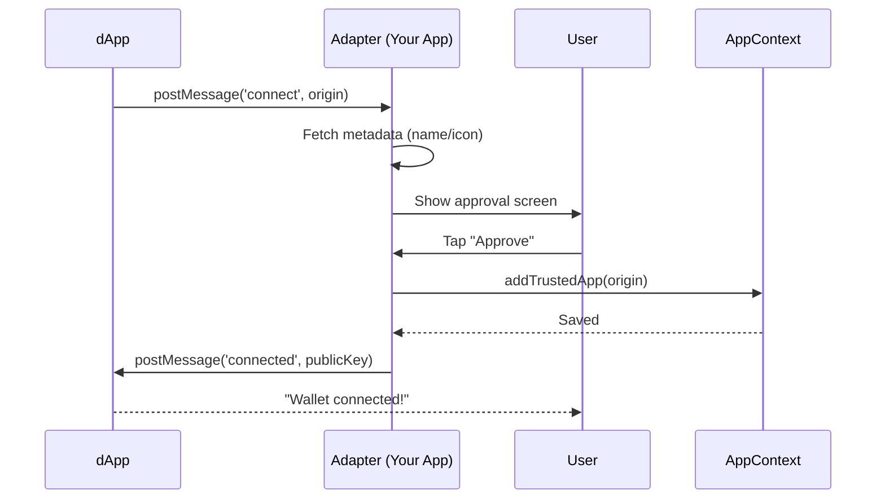

# Chapter 8: Wallet Adapter System

The wallet adapter system is Salmon’s bridge to external dApps: it handles connect, approve, sign, and message flows with user-controlled prompts.

## Goals
- Use standard Solana adapter interfaces so dApps integrate without custom code.  
- Make approvals explicit with clear dApp identity (name, icon, domain).  
- Simulate and summarize transactions before signing.  
- Handle decline paths cleanly—no silent failures.

## Core capabilities
- **Connect/Disconnect:** share public address after approval; revoke on request or inactivity.  
- **Sign Message:** show domain + reason; block blind signing.  
- **Sign Transaction(s):** simulate, display amounts/fees/programs; multi-instruction support.  
- **Eventing:** notify UI when connection state changes.

## Security expectations
- Verify origin/domain matches the prompt.  
- Require fresh approval after lock/unlock or network changes.  
- Rate-limit signature requests; surface suspicious bursts.  
- Never expose mnemonics/keys—sign inside isolated context.

## UX patterns
- Surface dApp metadata (favicon, verified domain, network).  
- Provide a concise diff: what’s being spent, destination, programs involved.  
- Offer “Reject” as a first-class action; don’t hide behind secondary UI.  
- Persist last connected dApp list for user review and revocation.

## Testing checklist
- Connect from a sample dApp succeeds and shows correct address + network.  
- Declining connect/sign returns explicit errors to the dApp.  
- Simulation errors block signing and show the error reason.  
- Switching networks forces re-approval.

## Tips for maintainers
- Keep adapter package versions current with Solana ecosystem changes.  
- Log connection attempts and outcomes (sanitized) to spot flaky integrations.  
- Add feature flags for experimental adapters without impacting stable flows.

## Key Concepts in the Wallet Adapter System

Let's break this down like a security checkpoint at an event: first the entry scan (connection approval), then the pat-down for actions (signing transactions or messages), and finally the oversight (simulation for safety). Everything revolves around listening for requests from dApps and responding securely, using platform-specific bridges like NativeModules for mobile or Chrome APIs for extensions.

### 1. Connection Approval: The Initial Handshake
When a dApp wants to connect, it sends a "connect" request with its origin (website URL) and metadata (name, icon). The adapter fetches this info (if needed) and shows a simple approval screen: "Allow NFT Marketplace to view your address?" Users tap approve to add it as a "trusted app," sharing only the public key. No private keys involved—it's read-only access.

In our use case, this happens first: The dApp button triggers a popup or native screen in your wallet app. Input: dApp origin (e.g., "https://nftmarket.com"). Output: If approved, the dApp gets the user's Solana address (e.g., "abc123..."), enabling features like balance display. Analogy: Like friending someone on social media—they see your profile pic, but not your full history.

Simplified flow in `AdapterDetail.js`:

```javascript
// From src/pages/Adapter/components/AdapterDetail.js - Handling connect
const connect = async () => {
  setConnected(true);  // Mark as approved
  await addTrustedApp(origin, { name, icon });  // Save to trusted list (via AppContext)
  postMessage({  // Send back to dApp
    method: 'connected',
    params: { publicKey: activeBlockchainAccount.getReceiveAddress() }  // Share address only
  });
};
```

**What happens here?** Input: User taps "Approve" on the form. Output: Adds the dApp to trusted apps (stored securely via [Storage and Persistence Layer](05_storage_and_persistence_layer.md)), sends a response message with the public address. If rejected, it sends an error. This keeps it lightweight—trusted apps remember approvals for future connects.

### 2. Transaction Signing: Securely Approving Actions
Once connected, dApps request signs for transactions (e.g., "Sign this buy NFT transfer"). The adapter shows details like "Send 0.5 SOL to seller?" and, if approved, signs using the private key (derived from seed, never exposed) and returns the signature. Supports single or batch ("signAllTransactions") via unified methods.

For our use case, after connecting, the dApp asks to sign a purchase. Input: Encoded transaction payload (e.g., base58 string from Solana). Output: Signed transaction (e.g., base58 signature) sent back, ready for the dApp to broadcast. Analogy: Like signing a check—you verify the amount, then authorize without handing over your checkbook.

From `SignTransactionForm.js` (used in AdapterDetail):

```javascript
// From src/pages/Adapter/components/SignTransactionForm.js - Signing a transaction
const createSignature = () => {
  const secretKey = bs58.decode(activeBlockchainAccount.retrieveSecurePrivateKey());  // Get key safely
  return bs58.encode(nacl.sign.detached(payload, secretKey));  // Sign the payload
};

const getMessage = () => ({
  result: {
    signature: createSignature(),  // The signed output
    publicKey: activeBlockchainAccount.publicKey.toBase58()
  },
  id: request.id  // Match the dApp's request
});
```

**What happens here?** Input: Payload from dApp request. Output: A response message with the signature (using NaCl for secure signing) and public key—no full private key shared. The form component shows a preview screen first, calling this only on approve. For batches, it loops over multiple payloads.

### 3. Message Signing and Simulation: Extra Safety Checks
For non-transaction requests (e.g., "Sign this message for login"), it decodes and displays the text (e.g., "Verify ownership") for approval, then signs similarly. For transactions, it often simulates first (via an external simulation API) to preview effects (e.g., "Will receive 1 NFT, cost 0.5 SOL") and flag risks (e.g., high fees warning).

In our use case, before signing a buy, simulation runs to show "Expected: +1 NFT, -0.5 SOL" on the approval screen. Input: Transaction payload. Output: Preview details (e.g., state changes like balance diffs) for user review. Analogy: Like a trial run of a recipe—see if it "burns" your balance before cooking.

Simplified simulation display in `SimulatedTransactions.js`:

```javascript
// From src/pages/Adapter/components/SimulatedTransactions.js - Showing simulation
const StateChange = ({ humanReadableDiff, rawInfo: { data } }) => {
  const value = data?.diff?.digits ? /* Format number with sign and symbol */ `${data.diff.sign === 'PLUS' ? '+' : ''}${formatNumber(data.diff.digits, data.decimals)} ${data.symbol}` : '';
  return (
    <BasicCard>
      <GlobalText color={data.diff.sign === 'PLUS' ? 'positive' : 'negativeLight'}>{value}</GlobalText>
      <GlobalText type="caption">{humanReadableDiff}</GlobalText>  // e.g., "NFT received"
    </BasicCard>
  );
};
```

**What happens here?** Input: Simulation results (array of changes from dApp or service). Output: Rendered cards showing gains/losses (green for +, red for -). If warnings (e.g., "Critical: Drains balance"), an alert appears. Ties into [UI Component Library](02_ui_component_library.md) for consistent cards. For messages, it decodes to readable text (UTF-8 or hex).

### 4. Platform Bridges: Web vs. Native Handling
The system adapts: On web/browser extensions, it uses `postMessage` for communication (e.g., popup windows). On mobile (React Native), it listens via NativeEventEmitter for requests from dApps. Both route to the same forms for approvals.

## Step-by-Step Walkthrough: Handling a dApp Connection and Transaction

Using our central use case, here's how the adapter manages a full flow—like a receptionist handling a guest arrival and requests:

1. **dApp requests connect** → Adapter listens (via message listener or native emitter), fetches dApp metadata (name/icon), shows `ApproveConnectionForm`.
2. **User approves** → Adds to trusted apps in [AppContext](04_appcontext.md), sends public address back via `postMessage`.
3. **dApp sends transaction request** → Adapter queues it, simulates (if Solana), shows `SimulatedTransactions` with previews and fees.
4. **User reviews and approves** → Calls signing (e.g., `nacl.sign`), sends signed response; rejects send error.
5. **dApp broadcasts** → Transaction goes to blockchain (via [Blockchain Account Abstraction](07_blockchain_account_abstraction.md)); adapter closes popup or returns focus.

For a visual of the connection approval:



**Explanation:** dApp initiates via message; adapter shows UI for user okay, updates context for persistence, responds. Four steps—quick handshake, securing the session.

## Deeper Dive: Under the Hood in Adapter Components

Internally, the system starts in `AdapterPage.js`, which loads on dApp trigger (e.g., via route navigation from [Route Navigation System](03_route_navigation_system.md)). It sets up the active network (e.g., Solana) and steps: Select (onboarding if needed) to Detail (handling requests).

In `AdapterDetail.js` (web/extension version), it uses `useEffect` to listen for messages:

```javascript
// From src/pages/Adapter/components/AdapterDetail.js - Listening for requests
useEffect(() => {
  function messageHandler(e) {
    if (e.origin === origin && e.data.method === 'connect') {  // Validate source
      setRequests(reqs => [...reqs, e.data]);  // Queue the request
    }
  }
  window.addEventListener('message', messageHandler);  // Hook into browser events
  return () => window.removeEventListener('message', messageHandler);
}, [origin]);
```

**Explanation:** Input: Incoming postMessage from dApp. Output: Adds to requests queue if authorized (e.g., 'connect' or 'signTransaction'). Then, `useMemo` picks the first request and renders the right form (e.g., SignTransactionsForm). For simulation, it calls an external API async before showing previews—non-code: Fetch payload > simulate on testnet > parse changes > display. Errors (e.g., invalid method) respond with "Unsupported" immediately.

For native (`AdapterDetail.native.js`), it swaps to React Native's NativeEventEmitter:

```javascript
// From src/pages/Adapter/components/AdapterDetail.native.js - Native listener
useEffect(() => {
  const emitter = new NativeEventEmitter(AdapterModule);  // Bridge to native code
  const listener = emitter.addListener('onRequest', setRequest);  // Set state on event
  return () => listener.remove();  // Cleanup
}, []);
```

**Explanation:** Input: Native module events (e.g., from iOS/Android bridge). Output: Updates `request` state, triggering the same forms. `AdapterModule.js` exposes native functions (e.g., completeWithDecline for rejects). Trusted apps store via [AppContext](04_appcontext.md) hooks, persisting in [Storage and Persistence Layer](05_storage_and_persistence_layer.md).

Signing uses `salmon-wallet-adapter` utils for secure key retrieval (encrypted in storage). Simulations decode payloads (bs58 for Solana) and format diffs (e.g., +1.5 SOL as green text with translations from [Translation System](06_translation_system.md)). For failures (e.g., simulation errors), shows `FailedTransactions` with retry option.

**Beginner tip:** Test by opening a dApp in dev mode—watch console for messages. If no requests, check origin matching.

## Wrapping Up: Your Secure Bridge to the dApp World

Congrats! You've now explored the Wallet Adapter System: a handshake protocol for safe dApp connections, transaction simulations, and signings, using approval forms and platform bridges to keep private keys hidden—like a vigilant doorman ensuring only trusted guests enter. This builds on abstractions from earlier chapters to enable real-world integrations, from simple connects to complex NFT buys, all user-controlled.

With this, your `salmonrepo` wallet is ready for the blockchain ecosystem—secure, intuitive, and beginner-proof!

---
